# Base de données `CeramicWorkshopDB`

PostgreSQL — 49 tables métier plus la table technique des migrations.
Toutes les dates sont enregistrées en UTC (`timestamp with time zone`) et affichées
dans le fuseau de l'atelier. Les montants utilisent une précision `numeric(18,2)`,
les quantités `numeric(18,3)` ou `numeric(18,4)`.

## 1. Arbre des tables

```
CeramicWorkshopDB
│
├── UTILISATEURS
│   ├── Users                    Comptes, empreinte du mot de passe, rôle, blocage
│   ├── Roles                    Administrateur, Responsable, Employé, Caissier
│   ├── Permissions              45 droits répartis en 9 modules
│   └── RolePermissions          Droits accordés à chaque rôle
│
├── CLIENTS
│   ├── Customers                Numéro client, coordonnées
│   └── CustomerNotes            Notes datées et signées
│
├── FOURNISSEURS
│   ├── Suppliers                Coordonnées, entreprise
│   └── SupplierPayments         Règlements versés aux fournisseurs
│
├── MATIÈRES PREMIÈRES
│   ├── MaterialCategories       Argile, émaux, pigments, emballage…
│   ├── Units                    kg, g, L, ml, pièce, m, m², boîte, unité
│   ├── Materials                Stock, seuils, coût moyen, emplacement
│   └── MaterialBatches          Lots reçus, coût réel, traçabilité
│
├── ACHATS
│   ├── Purchases                Achat fournisseur, total, payé, reste
│   └── PurchaseItems            Lignes d'achat par matière
│
├── PRODUITS
│   ├── ProductCategories        Vases, statues, assiettes, décorations murales…
│   ├── Products                 Dimensions, coût, prix, stock, code-barres, QR
│   ├── ProductImages            Photo principale, fabrication, produit terminé
│   └── ProductVariants          Déclinaisons de taille ou de couleur
│
├── RECETTES
│   ├── ProductRecipes           Recette d'un produit, rendement, coûts annexes
│   └── ProductRecipeItems       Matières et quantités, pourcentage de perte
│
├── PRODUCTION
│   ├── ProductionOrders         Ordre de fabrication, statut, coûts, dérogation
│   ├── ProductionMaterials      Matières réservées puis consommées
│   └── ProductionStageHistory   Historique daté de chaque étape
│
├── CUISSON
│   ├── Kilns                    Fours, capacité, températures, état
│   ├── FiringBatches            Fournées : température, durée, coût énergétique
│   └── FiringBatchItems         Pièces enfournées, acceptées, endommagées
│
├── DÉCORATION
│   ├── DecorationTypes          Émaillage, peinture, dorure, argenture…
│   ├── DecorationOrders         Travail de décoration, or et argent utilisés
│   └── DecorationImages         Photos du décor
│
├── CONTRÔLE QUALITÉ
│   ├── QualityChecks            Huit points de contrôle, quantités acceptées
│   └── QualityIssues            Défauts relevés, gravité, solution
│
├── COMMANDES PERSONNALISÉES
│   ├── CustomOrders             Dimensions, couleurs, prix, acompte, date limite
│   ├── CustomOrderImages        Photos de référence, croquis, fabrication
│   └── CustomOrderNotes         Échanges avec le client
│
├── VENTES
│   ├── Sales                    Vente, remise, total, payé, coût de revient
│   └── SaleItems                Lignes de vente
│
├── PAIEMENTS
│   ├── PaymentMethods           Espèces, virement, carte, chèque, autre
│   └── Payments                 Encaissements clients, acomptes, règlements
│
├── FACTURES
│   ├── Invoices                 Facture, TVA, total, payé, reste
│   └── InvoiceItems             Lignes de facture
│
├── INVENTAIRE
│   ├── InventoryTransactions    Tout mouvement de stock, avec stock avant/après
│   └── StockAdjustments         Régularisations justifiées
│
├── DÉPENSES
│   ├── ExpenseCategories        Électricité, gaz, transport, salaires…
│   └── Expenses                 Dépense, justificatif, mode de règlement
│
├── NOTIFICATIONS
│   ├── Notifications            Alertes de stock, d'échéance, de retard
│   └── NotificationSettings     Activation et seuils de chaque alerte
│
├── AUDIT
│   └── AuditLogs                Journal des opérations importantes
│
└── PARAMÈTRES
    ├── BusinessSettings         Identité de l'atelier, devise, préfixes
    └── SystemSettings           Réglages techniques (sauvegarde, seuils)
```

## 2. Relations principales

```
Users ──→ Roles ──→ RolePermissions ──→ Permissions
  │
  ├──→ ProductionOrders    (employé responsable)
  ├──→ Sales, Payments, Expenses, QualityChecks
  └──→ AuditLogs

Customers
  ├──→ CustomOrders ──→ CustomOrderImages, CustomOrderNotes, Payments
  ├──→ Sales ──→ SaleItems
  ├──→ Invoices ──→ InvoiceItems
  └──→ Payments

Suppliers
  ├──→ Purchases ──→ PurchaseItems ──→ Materials
  └──→ SupplierPayments

Materials
  ├──→ MaterialBatches
  ├──→ ProductRecipeItems
  ├──→ ProductionMaterials
  ├──→ PurchaseItems
  └──→ InventoryTransactions

Products
  ├──→ ProductImages, ProductVariants
  ├──→ ProductRecipes ──→ ProductRecipeItems ──→ Materials
  ├──→ ProductionOrders
  └──→ SaleItems

ProductionOrders
  ├──→ ProductionMaterials
  ├──→ ProductionStageHistory
  ├──→ FiringBatchItems ──→ FiringBatches ──→ Kilns
  ├──→ DecorationOrders ──→ DecorationImages
  ├──→ QualityChecks ──→ QualityIssues
  └──→ InventoryTransactions

Sales ──→ SaleItems, Payments, Invoices ──→ InvoiceItems
```

## 3. Diagramme ERD

```mermaid
erDiagram
    Roles ||--o{ Users : "attribue"
    Roles ||--o{ RolePermissions : "possede"
    Permissions ||--o{ RolePermissions : "accordee"

    Customers ||--o{ CustomOrders : "commande"
    Customers ||--o{ Sales : "achete"
    Customers ||--o{ Invoices : "facture"
    Customers ||--o{ Payments : "regle"

    Suppliers ||--o{ Purchases : "fournit"
    Suppliers ||--o{ SupplierPayments : "recoit"
    Purchases ||--o{ PurchaseItems : "contient"
    Purchases ||--o{ SupplierPayments : "reglee_par"

    MaterialCategories ||--o{ Materials : "classe"
    Units ||--o{ Materials : "mesure"
    Materials ||--o{ MaterialBatches : "recu_en"
    Materials ||--o{ PurchaseItems : "achetee"
    Materials ||--o{ ProductRecipeItems : "composee"
    Materials ||--o{ ProductionMaterials : "consommee"
    Materials ||--o{ InventoryTransactions : "mouvementee"
    PurchaseItems ||--o{ MaterialBatches : "genere"

    ProductCategories ||--o{ Products : "classe"
    Products ||--o{ ProductImages : "illustre"
    Products ||--o{ ProductVariants : "decline"
    Products ||--o{ ProductRecipes : "fabrique_par"
    Products ||--o{ ProductionOrders : "produit"
    Products ||--o{ SaleItems : "vendu"
    ProductRecipes ||--o{ ProductRecipeItems : "detaille"

    ProductionOrders ||--o{ ProductionMaterials : "reserve"
    ProductionOrders ||--o{ ProductionStageHistory : "avance"
    ProductionOrders ||--o{ FiringBatchItems : "enfourne"
    ProductionOrders ||--o{ DecorationOrders : "decore"
    ProductionOrders ||--o{ QualityChecks : "controle"
    ProductionOrders ||--o{ InventoryTransactions : "alimente"

    Kilns ||--o{ FiringBatches : "cuit"
    FiringBatches ||--o{ FiringBatchItems : "contient"
    DecorationTypes ||--o{ DecorationOrders : "type"
    DecorationOrders ||--o{ DecorationImages : "photographie"
    QualityChecks ||--o{ QualityIssues : "releve"

    CustomOrders ||--o{ CustomOrderImages : "illustre"
    CustomOrders ||--o{ CustomOrderNotes : "annote"
    CustomOrders ||--o{ ProductionOrders : "declenche"
    CustomOrders ||--o{ Payments : "acompte"
    CustomOrders ||--o{ Invoices : "facturee"

    Sales ||--o{ SaleItems : "contient"
    Sales ||--o{ Payments : "encaissee"
    Sales ||--o{ Invoices : "facturee"
    Invoices ||--o{ InvoiceItems : "detaille"
    PaymentMethods ||--o{ Payments : "mode"

    StockAdjustments ||--o{ InventoryTransactions : "justifie"
    ExpenseCategories ||--o{ Expenses : "classe"
    Users ||--o{ AuditLogs : "journalise"
```



## 4. Flux métier

### Achat de matières

```
Fournisseur → Achat → Lignes d'achat → Matière → Lot de matière
           → Mouvement d'inventaire → Stock augmenté
```

### Production

```
Produit → Recette → Matières nécessaires → Ordre de production
       → Vérification du stock → Consommation des matières
       → Préparation → Façonnage → Séchage → Première cuisson
       → Décoration → Cuisson finale → Contrôle qualité
       → Produit terminé → Stock des produits finis augmenté
```

### Vente

```
Client → Vente → Produits → Quantité → Prix → Remise → Total
      → Paiement → Facture → Stock diminué → Mouvement d'inventaire
```

### Commande personnalisée

```
Client → Commande personnalisée → Photos et croquis → Conception
      → Validation client → Production → Cuisson → Décoration
      → Contrôle qualité → Prêt → Paiement final → Livraison
```

## 5. Conventions techniques

| Sujet | Règle |
|-------|-------|
| Clés primaires | Entier auto-incrémenté nommé `Id` |
| Numéros de documents | Champ `Reference` ou `…Number`, unique, préfixe paramétrable |
| Dates | `timestamp with time zone`, toujours écrites en UTC |
| Montants | `numeric(18,2)` |
| Quantités | `numeric(18,3)` ou `numeric(18,4)` pour les recettes |
| Suppression | Physique pour les données de référence, logique pour les documents financiers |
| Traçabilité | `CreatedAt`, `CreatedByUserId`, `UpdatedAt`, `UpdatedByUserId` remplis automatiquement |
| Suppression en cascade | Réservée aux lignes d'un document ; les références sont protégées |
